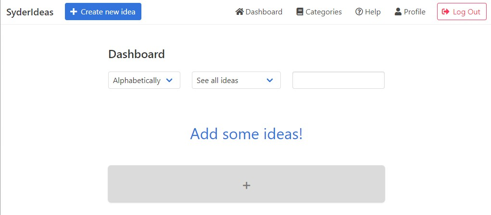
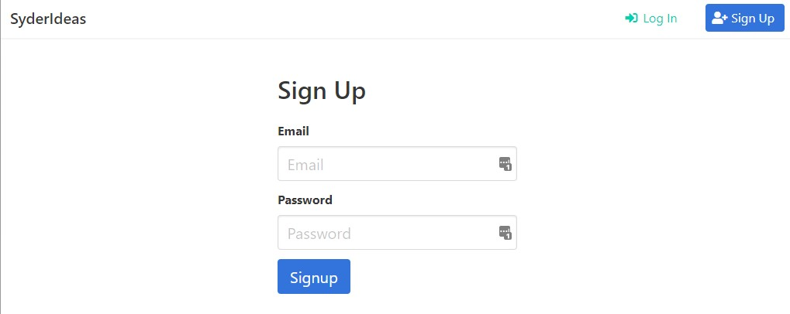
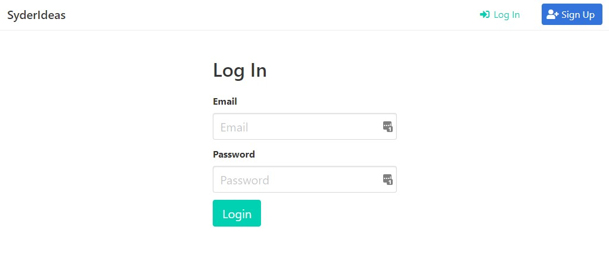
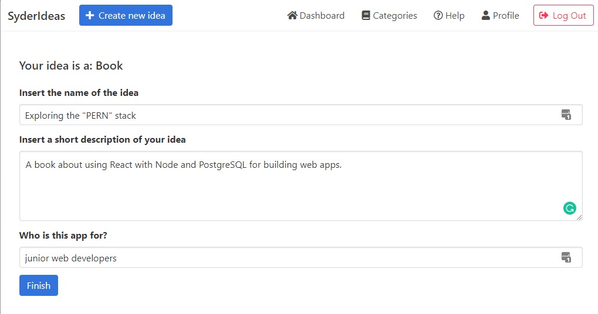
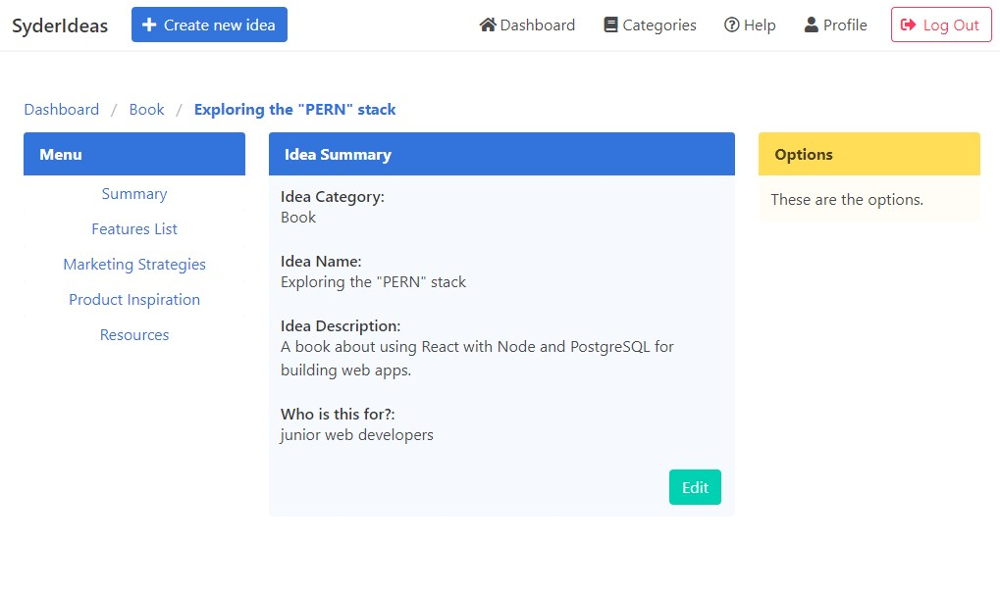
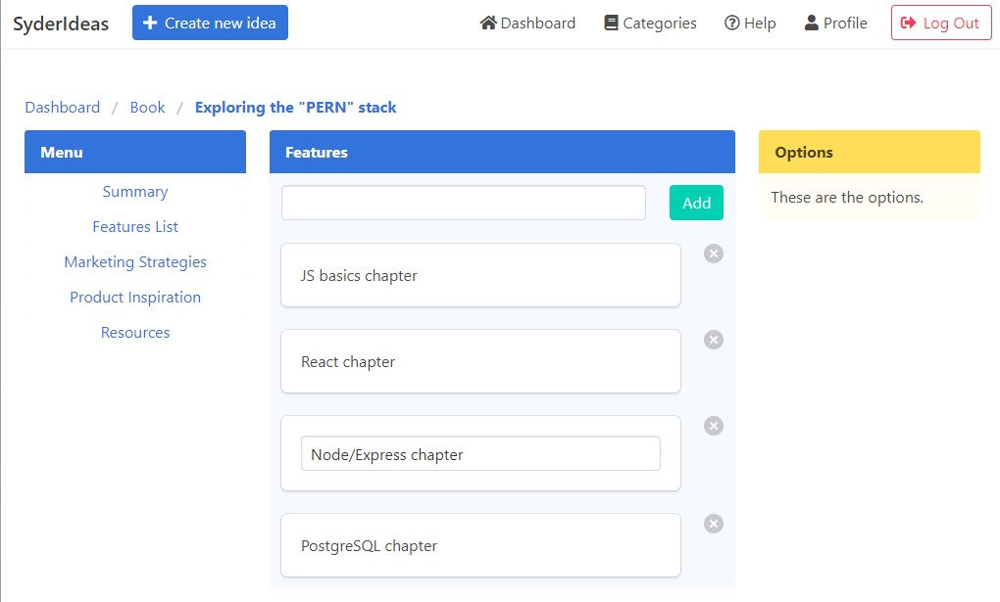
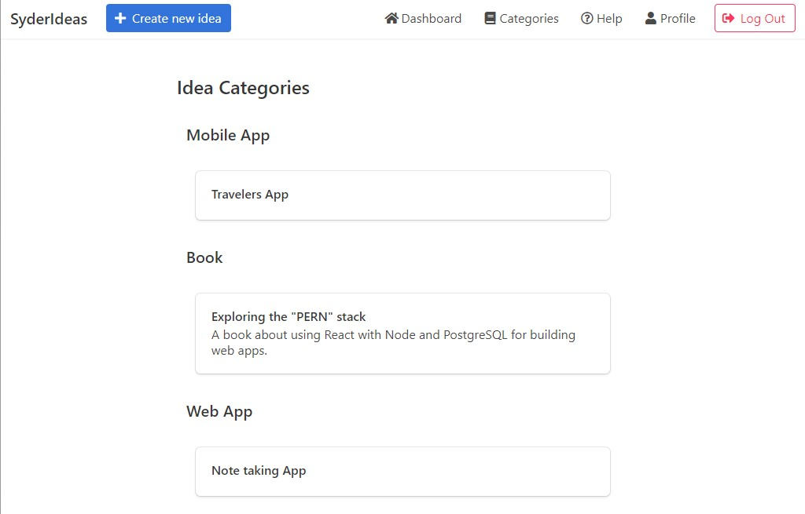

<h1 align="center">Syder Ideas</h1>
<p align="center">
  <a href="https://github.com/guidosantillan01/syder-ideas">
    
  </a>
</p>

<p align="center">
  Keep your ideas under control.
</p>

## Table of Contents
* [Introduction](#introduction)
* [Demo](#demo)
* [Features](#features)
* [Usage Example](#usage-example)
* [Quick Guide](#quick-guide)
* [Getting Started](#getting-started)
* [Built With](#built-with)
* [Release History](#release-history)
* [Road-map](#road-map)
* [Contributing](#contributing)
* [Authors](#authors)
* [License](#license)
<!-- * [Acknowledgements](#acknowledgements) -->

<!-- * [Development Setup](#development-setup)
* [Running the tests](#running-the-tests)
* [Important Considerations](#important-considerations) -->
---

## Introduction

<!-- [](https://travis-ci.org/gitpoint/git-point)
[](https://coveralls.io/github/gitpoint/git-point)
[](./CONTRIBUTORS.md)
[](http://makeapullrequest.com) -->

>Syder Ideas is a web application where you can store your side-project ideas in an easy, intuituve and systems based. It is powered by React and Node.





## Demo
Here is a working live demo:
- [Server demo](https://syder-ideas-server.herokuapp.com/)
- [Client demo](https://syder-ideas-client.herokuapp.com/)


## Features
<!-- *What's all the bells and whistles this project can perform? What's the main functionality* -->
* User authentication.
* Store your ideas.
* Store features for your ideas.


## Usage example

<!-- > *A few motivating and useful examples of how your product can be used. Spice this up with code blocks and potentially more screenshots.* *For more examples and usage, please refer to the [Wiki][wiki].* -->

#### Sign Up and Log In



#### Edit your idea


#### Idea dashboard


#### Features list


#### Ideas sorted by category



---

## Quick Guide

To clone and run this application, you'll need [Git](https://git-scm.com) and [Node.js](https://nodejs.org/en/download/) (which comes with [npm](http://npmjs.com)) installed on your computer. From your command line:
1. Clone this repository
```sh
git clone https://github.com/guidosantillan01/syder-ideas
```
2. Go into the SERVER folder
```sh
cd syder-ideas/server
```
3. Install dependencies
```sh
npm install
```
4. Run the server, you will then be able to access it at `localhost:5000`
```sh
npm run server
```
5. Open another code editor instance
6. Go into the CLIENT folder
```sh
cd syder-ideas/client
```
7. Install dependencies
```sh
npm install
```
8. Run the app, you will then be able to access it at `localhost:3000`
```sh
npm run client
```

> Note: If you're using Linux Bash for Windows, [see this guide](https://www.howtogeek.com/261575/how-to-run-graphical-linux-desktop-applications-from-windows-10s-bash-shell/) or use `node` from the command prompt.


---

## Getting Started
> *These instructions will get you a copy of the project up and running on your local machine for development and testing purposes. See deployment for notes on how to deploy the project on a live system.*

### Prerequisites
> *What things you need to install the software and how to install them*

#### Database
* You will need a PostgreSQL server. pgAdmin4 is recommended to interact with the server.
* Create a database with these [queries](./docs/postgresql_queries.sql).
* Create a test database.
* Create a production database.


### Deploying / Publishing

You need to have a Heroku account.

Create a server project, setup `DATABASE_URL` config var
Create a client project, setup `REACT_APP_ENDPOINT` config var

**To deploy the SERVER to Heroku:**
1. Push all changes to Github
1. Go to root folder
1. Check remote repos
```sh
git remote -v
```
1. Deploy to Heroku
```sh
git subtree push --prefix server heroku-server master
```

**To deploy the CLIENT to Heroku**
1. Repeat the same steps
1. Deploy to Heroku
```sh
git subtree push --prefix client heroku-client master
```

<!--
### Initial Configuration
> *Some projects require initial configuration (e.g. access tokens or keys, npm i). This is the section where you would document those requirements.*


### Installation

*This project* requires [Node.js](https://nodejs.org/) v4+ to run.

> *Install the dependencies and devDependencies and start the server.*

```sh
$ cd dillinger
$ npm install -d
$ node app
```

> *For production environments...*

```sh
$ npm install --production
$ NODE_ENV=production node app
```

 

## Development setup
>*Here's a brief intro about what a developer must do in order to start developing
the project further:*

Clone this repo to your desktop and run `npm install` to install all the dependencies.


```sh
git clone https://github.com/your/awesome-project.git
cd awesome-project/
packagemanager install
```

And state what happens step-by-step.

### Building

If your project needs some additional steps for the developer to build the
project after some code changes, state them here:

```shell
./configure
make
make install
```

Here again you should state what actually happens when the code above gets
executed.


## Running the tests
Explain how to run the automated tests for this system

### Break down into end to end tests

*Explain what these tests test and why*

```
Give an example
```

### And coding style tests

*Explain what these tests test and why*

```
Give an example
```

---


## Important Considerations
* abc
* abc
* abc -->


## Built with
This project uses a number of open source projects to work properly:

* [ReactJS](https://reactjs.org/) - A JavaScript library for building user interfaces.
* [React-Router](https://reacttraining.com/react-router/web/guides/quick-start) - Declarative Routing for React.js.
* [Redux](https://redux.js.org/) - A predictable state container for JavaScript apps.
* [node.js](https://nodejs.org/en/) - Node.js® is a JavaScript runtime built on Chrome's V8 JavaScript engine.
* [Express](https://expressjs.com/) - Fast, unopinionated, minimalist web framework for Node.js
* [PostgreSQL](https://www.postgresql.org/) - Open Source relational database
* [ESLint](https://eslint.org/) - The pluggable linting utility for JavaScript and JSX.
* [Prettier](https://prettier.io/) - An opinionated code formatter.
* [Passport](http://www.passportjs.org/) - Passport is authentication middleware for Node.js
* [node-postgres](https://node-postgres.com/) - A collection of node.js modules for interfacing with your PostgreSQL database.
* [bcrypt](https://www.npmjs.com/package/bcrypt) - A library to help you hash passwords.
* [Bulma](https://bulma.io/) - Open source CSS framework based on Flexbox 


## Release History
2019/05/28 - v1

2019/01/29 - Styling

2019/01/24 - Basic functioning


## Road-map

### Client
* Implement other fields in React: 
  * Competitors and Inspiration.
  * Strategies.
  * Business Model.
  * Planning.
  * Resources.
* Implement client testing.
* Define error boundaries using `componentDidCatch()`.
* Improve redux async fetch functions. Examples from Andrew Node Course:
  * REQUEST_ROBOTS_PENDING
  * REQUEST_ROBOTS_SUCCESS
  * REQUEST_ROBOTS_FAILED
* Deploy and test front-end.
* Fix Nav bar in mobile screen.


### Server
* Implement API routing for new client features (Strategies, Inspiration, etc.)
* Refactor API functions using async-await.
* Handling Express errors.
* Deploy and test back-end.

---

## Contributing
If you'd like to contribute, please fork the repository and use a feature branch. Pull requests are warmly welcome.


## Authors
* Guido Santillan Arias - [info@guidosantillan.com](mailto:info@guidosantillan.com) - [www.guidosantillan.com](https://www.guidosantillan.com)

See also the list of [contributors](https://github.com/your/project/contributors) who participated in this project.


## Licence
This project is licensed under the **MIT license** - see the [LICENSE](./LICENSE.txt) file for details.
